# 背景
自社では取引業者が多岐にわたり、県内外の企業を対象にしており
# 目的
一台のコンピュータで管理している現システムをネットワークを利用したWebシステムに変更し、ブラウザを利用して各部署からでも情報を取り出せるように効率の向上をする。
また、検索条件として企業の所在県、業種を設定検索できることとする。

#　システム全体図

# 要求一覧 
| 大分類             | 小分類      | 要件  | 優先度    |備考|
 | -------------- | ------------- | ------- | ------- |--|
 | 基本要件 | 利用環境 |サービスの利用にあたって、クライアント端末にアプリケーションをインストールすることなくブラウザから利用出来る|　高 |　|
 |  | ユーザ管理 | ユーザIDとパスワードを用いたログインできる |高 | |
 |  | デザイン | サイト全体として、統一されたページデザインにすること | 中 | |
 | 検索要件 | 所在県検索 | 指定した所在県より抽出ができる | 高 | 複合条件でも検索可能とする |
 | |業種検索 | 指定した業種より抽出できる|高|
 ||条件無し|すべての企業を抽出できる|高|
 |企業情報登録|企業情報登録|管理画面から企業情報を登録することができる|高|
 |企業情報保守|企業情報編集|管理画面から企業情報を編集することができる|高|
 ||企業情報削除|管理画面から企業情報を削除することができる|高|

# ユースケース
 
 